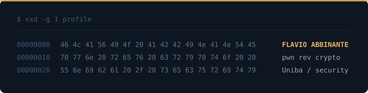

  

# Flavio Abbinante

Computer Science student (L-31) at the University of Bari and junior IT engineer, moving toward a master's in cybersecurity.

## CTF

I play in **pwn**, **rev**, **crypto** and **forensics**. Writeups: [`writeupctf`](https://github.com/flavioabbinante/writeupctf)

- [Hyperelliptic Drift](https://github.com/flavioabbinante/writeupctf) — `crypto` — lattice attack on the hidden number problem, against ECDSA nonces from a hyperelliptic-curve PRNG
- [aName](https://github.com/flavioabbinante/writeupctf) — `pwn` — heap relative write turned into a GOT overwrite
- [mail0g](https://github.com/flavioabbinante/writeupctf) — `forensics` — data exfiltrated hex-encoded inside SMTP recipient addresses

Between competitions I train on [pwn.college](https://pwn.college).

## Contact

[email](mailto:fabbinante10@outlook.com) 
